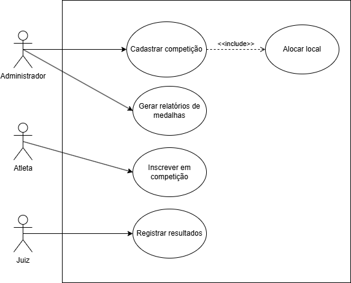
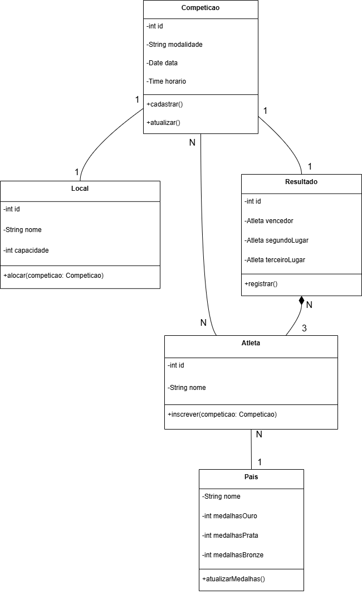
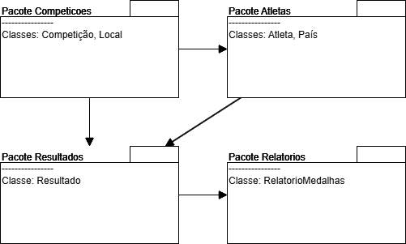
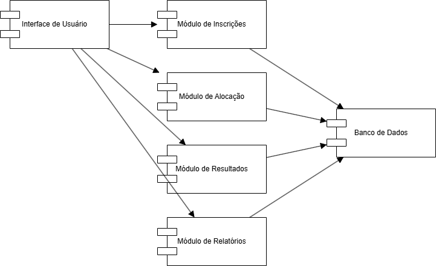
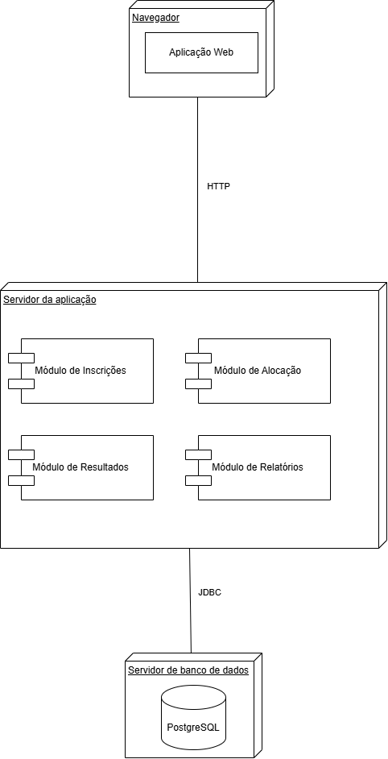

# Sistema de Gestão das Olimpíadas (SGO)

## Descrição
O Sistema de Gestão das Olimpíadas (SGO) foi projetado para coordenar todos os aspectos relacionados à organização das Olimpíadas, incluindo:
- Gerenciamento de competições
- Inscrição de atletas
- Alocação de locais para provas
- Controle de resultados
- Relatórios de medalhas por país

Este projeto contém a modelagem UML completa do sistema, seguindo as regras de negócio definidas.

---

## Regras de Negócio

1. **Cadastro de Competições**
 - Nome da modalidade, data, horário, local e lista de atletas inscritos.
2. **Inscrição de Atletas**
 - Atletas de diferentes países podem se inscrever em competições específicas.
 - Um atleta pode participar de várias competições, mas só pode representar um país por modalidade.
3. **Alocação de Locais**
 - Evitar conflitos de horário.
 - Um local só pode abrigar uma competição por vez.
4. **Controle de Resultados**
 - Registro de resultados após a competição.
 - Determinar vencedor e classificados em segundo e terceiro lugares.
5. **Relatórios de Medalhas**
 - Relatórios por país, mostrando medalhas de ouro, prata e bronze.

---

## Histórias de Usuário

**US01 - Cadastrar Competição**  
> Como administrador, quero cadastrar uma competição informando modalidade, data, horário e local, para que o evento seja registrado no sistema.

**US02 - Inscrever Atleta**  
> Como atleta, quero me inscrever em uma competição específica, para poder participar representando meu país.

**US03 - Alocar Local para Competição**  
> Como administrador, quero alocar um local para uma competição sem conflitos de horário, para garantir que cada local seja usado apenas por uma competição por vez.

**US04 - Registrar Resultados**  
> Como juiz, quero registrar os resultados da competição, indicando vencedor, segundo e terceiro lugar, para que o sistema possa gerar relatórios.

**US05 - Gerar Relatório de Medalhas**  
> Como administrador, quero gerar um relatório de medalhas por país, para acompanhar o desempenho das delegações.

---

## Diagramas UML

### 1. Diagrama de Caso de Uso

### 2. Diagrama de Classes

### 3. Diagrama de Pacotes

### 4. Diagrama de Componentes

### 5. Diagrama de Implantação

